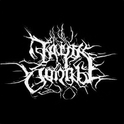

# This Black Metal Band Does Not Exist
Black metal logo generator based on StyleGan2

For more info visit http://www.thisblackmetalbanddoesnotexist.com

There are two Jupyter Notebook files here:
- MetalGAN_generation.ipynb for generating new samples using my network
- MetalGAN_training.ipynb for training StyleGan2 on my dataset

They are to be used with [Google Colab](https://colab.research.google.com) platform.
